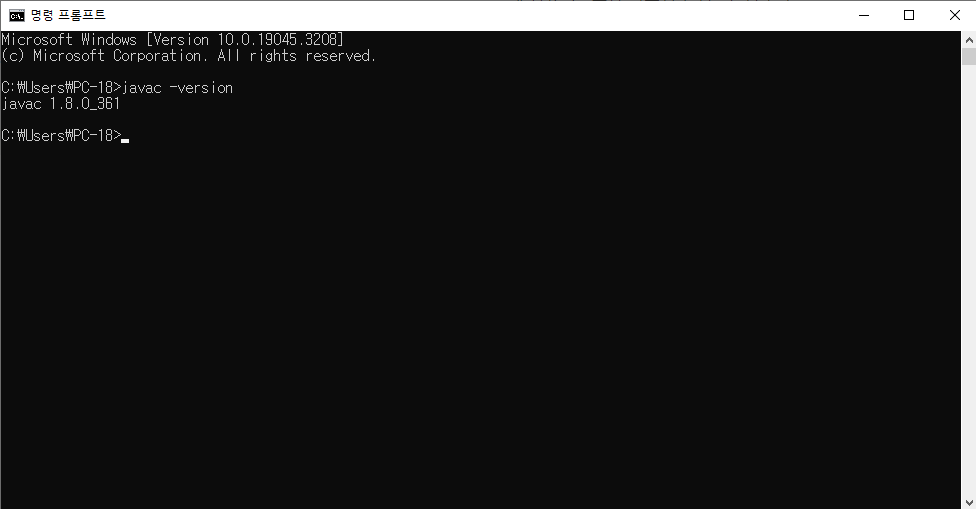

# 수업 일부

###  23.07.03

---

# **자바 설치**

jdk-8u361-windows-x64

# 이클립스 설치

eclipse-jee-2020-06-R-win32-x86_64

# **환경 변수 설정**

내 컴퓨터 - 고급 시스템 설정 - 환경 변수 

1. 새로만들기 JAVA_HOME / 자바 설치경로
2. Path변수 편집 - bin폴더 (%JAVA_HOME%\bin)

환경 변수가 올바르게 설정되었는지 확인하려면 cmd 명령 프롬프트 실행 후 **javac -version**을 입력

본격적인 자바 공부를 시작하기 앞서, 자바와 이클립스를 설치하고 환경 변수를 설정하였다.

### HelloJava.java

### Person.java

소스 코드를 작성하고 간단하게 “안녕하세요”라는 문자열을 출력하는 코드를 입력해보았다.